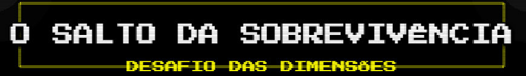
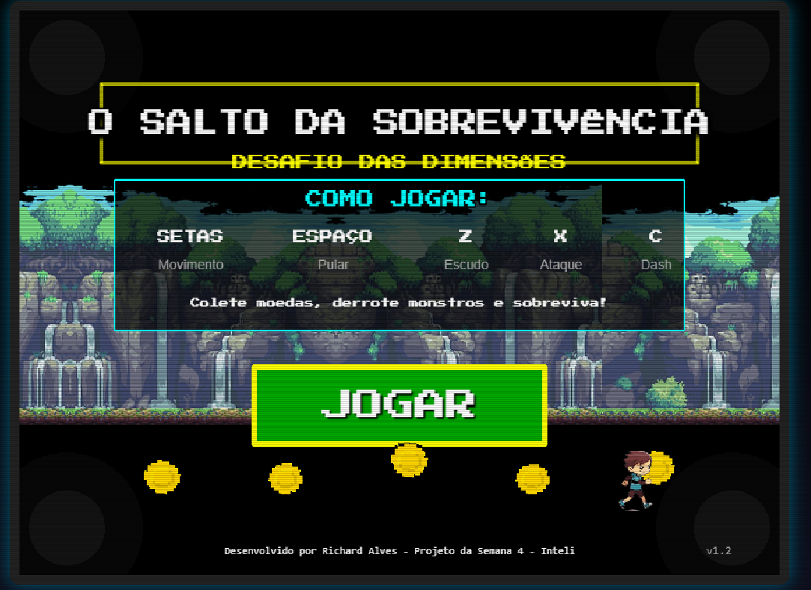
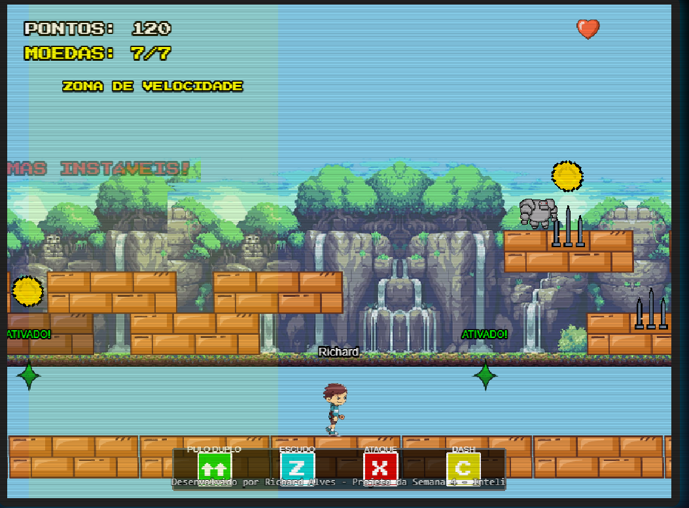
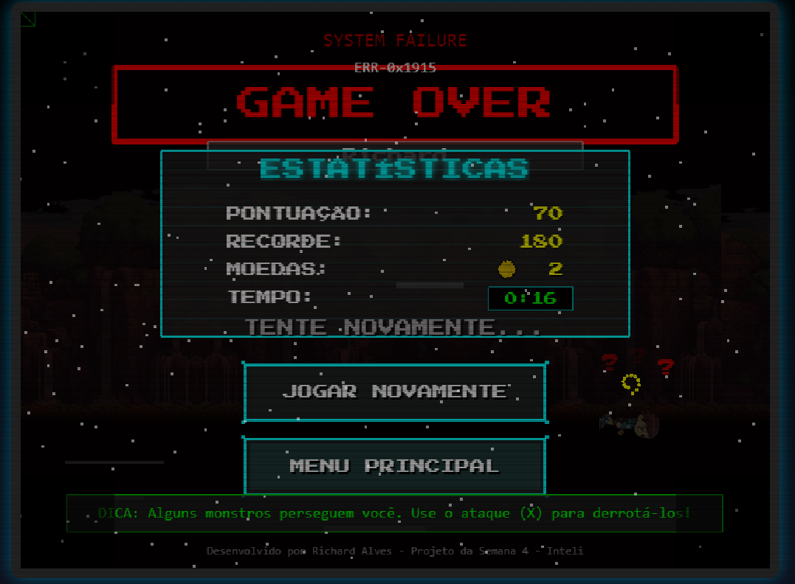
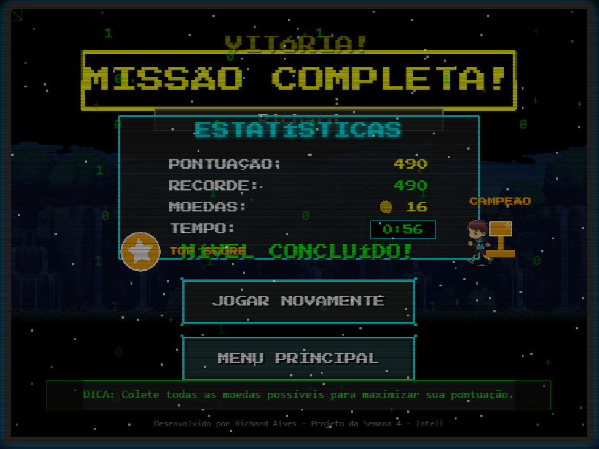

# O Salto da Sobrevivência: Desafio das Dimensões 🎮



## 📝 Sobre o Projeto

**O Salto da Sobrevivência: Desafio das Dimensões** é um jogo de plataforma 2D com uma estética retrô, desenvolvido como parte da Semana 4 do Módulo 1 do curso de Ciência da Computação do Inteli. Criado utilizando **JavaScript** e o framework **Phaser 3**, o jogo explora conceitos de desenvolvimento de jogos, física de movimento e gerenciamento de estados.

🎮 **Jogue agora [clicando aqui](https://richarddalves.github.io/O_Salto_Da_Sobrevivencia/) ou pelo link: [https://richarddalves.github.io/O_Salto_Da_Sobrevivencia/](https://richarddalves.github.io/O_Salto_Da_Sobrevivencia/)**

---

## 🎯 Objetivo do Jogo

Controle o personagem através de diferentes plataformas, colete moedas, derrote monstros e alcance o portal de saída. Para completar o nível, é necessário coletar pelo menos **7 moedas**.

---

## 🕹️ Controles

- **Setas direcionais (←→)**: Movimentar o personagem
- **Seta para cima (↑) ou Espaço**: Pular
- **Pulo duplo**: Pressione ↑ ou Espaço novamente enquanto estiver no ar
- **Z**: Ativar escudo protetor (invencibilidade temporária)
- **X**: Atacar (elimina inimigos próximos)
- **C**: Dash (movimento rápido com invencibilidade)

---

## ✨ Recursos do Jogo

- **Sistema de vidas**: O jogador começa com 3 vidas.
- **Sistema de pontuação**:
  - Moedas: 10 pontos cada (colete pelo menos 7 para completar o nível).
  - Inimigos:
    - Patrulheiros: 30 pontos
    - Perseguidores: 50 pontos
  - **Boss Final**: Requer múltiplos ataques para ser derrotado.
- **Checkpoints**: Salve seu progresso ao longo do caminho.
- **Plataformas especiais**:
  - Móveis (horizontal, vertical e circular).
  - Desaparecem ao serem pisadas.
- **Zonas especiais**:
  - Baixa gravidade.
  - Alta velocidade.
- **Power-ups**:
  - Escudo protetor.
  - Super pulo.
  - Ataque poderoso.
  - Super velocidade.

---

## 🏆 Desafios e Níveis

O jogo apresenta dificuldade progressiva, dividida em cinco etapas:

1. **Tutorial**: Aprenda os controles básicos.
2. **Plataformas Instáveis**: Teste seus reflexos em plataformas que desaparecem.
3. **Zona de Perigo**: Enfrente espinhos e monstros.
4. **Desafio de Plataformas**: Navegue por padrões complexos de plataformas móveis.
5. **Boss Final**: Encare um monstro poderoso antes de completar o jogo.

---

## 🔧 Tecnologias Utilizadas

- **HTML5 / CSS3**: Estrutura e estilização da interface.
- **JavaScript**: Linguagem principal do jogo.
- **Phaser 3**: Framework para desenvolvimento de jogos 2D.
- **ES6 Modules**: Modularização do código.

---

## 📂 Estrutura de Arquivos

```
O_Salto_Da_Sobrevivencia/
│
├── assets/                  # Recursos visuais
│   ├── fundo.png            # Imagem de fundo
│   ├── moeda.png            # Sprite da moeda
│   ├── coracao.png          # Sprite de vida
│   ├── tijolos.png          # Sprite das plataformas
│   ├── espinho.png          # Sprite dos obstáculos
│   ├── monstro.png          # Sprite dos inimigos
│   ├── brilho.png           # Efeito visual
│   └── sprites/             # Sprites animados
│       └── personagemAndando3.png  # Spritesheet do personagem
│
├── src/
│   ├── main.js              # Ponto de entrada principal
│   ├── styles/              # Estilos CSS
│   │   └── style.css        # Estilos do jogo
│   └── scenes/              # Cenas do jogo
│       ├── WelcomeScene.js  # Tela inicial
│       ├── GameScene.js     # Cena principal do jogo
│       └── GameOverScene.js # Tela de fim de jogo
│
├── index.html               # Arquivo principal
└── README.md                # Este arquivo
```

---

## 📸 Screenshots

| Tela Inicial                            | Gameplay                            |
| --------------------------------------- | ----------------------------------- |
|  |  |

| Game Over                            | Missão Completa                            |
| ------------------------------------ | ------------------------------------------ |
|  |  |

---

## 🚀 Como Jogar

### **Online**

Acesse diretamente pelo navegador:
**[Jogar O Salto da Sobrevivência](https://richarddalves.github.io/O_Salto_Da_Sobrevivencia/)**

### **Localmente**

1. Clone o repositório:

   ```bash
   git clone https://github.com/richarddalves/ENTREGAS_Inteli.git
   ```

2. Navegue até a pasta do projeto:

   ```bash
   cd ENTREGAS_Inteli/M1/Semana_04/O_Salto_Da_Sobrevivencia
   ```

3. Execute o jogo em um servidor local:
   - Utilize a extensão **Live Server** no VS Code.
   - Ou execute um servidor HTTP simples (exemplo com Python):
     ```bash
     python -m http.server
     ```

> **Nota**: Devido a restrições de segurança, abrir o arquivo `index.html` diretamente pode não funcionar corretamente. Recomenda-se usar um servidor local.

---

## 🔄 Melhorias Futuras

- Expansão do jogo com novos níveis.
- Novos tipos de inimigos.
- Sistema de progressão entre níveis.
- Adição de efeitos sonoros e trilha sonora.
- Melhor adaptação para dispositivos móveis.

---

## 👨‍💻 Autor

**Richard Alves**  
Aluno do curso de Engenharia de Software do **Inteli**.

---

## 📜 Licença

Este projeto foi desenvolvido para fins educacionais como parte do curso de Ciência da Computação do **[Inteli](https://www.inteli.edu.br/)**.

---

🚀 _Desenvolvido por Richard Alves - Projeto da Semana 4 - Inteli_
